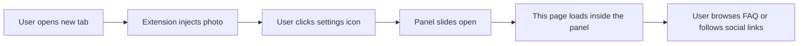

# Future Vizion - Chrome Extension Page

Companion landing page for the **Future_Vizion Photo New Tab** Chrome extension by [Guillermo Alarcor](https://www.futurevizion.jp/). Every time you open a new tab, a handpicked high-resolution photograph replaces the default Chrome page.

**Live:** [future-vizion.cuatro.dev](https://future-vizion.cuatro.dev)

<p align="center">
    
    
    
    
    
</p>

---

## What it is

This is the info page served inside the Chrome extension when the user clicks the settings panel. It covers:

- Artist biography and design philosophy
- FAQ (style, pricing, contact, how the extension works)
- Links to prints, contact form, and social channels

## User flow



## Stack decisions

| Decision  | Choice             | Why                                                                    |
| --------- | ------------------ | ---------------------------------------------------------------------- |
| Framework | None               | Single static page, no routing or state needed                         |
| CSS       | Vanilla + minified | Design-heavy animations handled without runtime overhead               |
| JS        | jQuery + vanilla   | Lightweight enough; parallax and canvas background in one bundled file |
| Deploy    | Vercel             | Zero-config static hosting, custom domain via CNAME                    |

## Local setup

No build step required.

```bash
git clone git@github.com:LuigiEspinosa/future-vizion.git
cd future-vizion
# open index.html directly in a browser, or use any static file server:
npx serve .
```

## Build Phases

| Phase           | Status | Notes                                               |
| --------------- | ------ | --------------------------------------------------- |
| Design + assets | Done   | Minified CSS and JS, custom icon fonts              |
| HTML structure  | Done   | Single page, sliding panel, FAQ sections            |
| Animations      | Done   | Canvas background, parallax scroll, CSS transitions |
| Deploy          | Done   | Vercel + custom domain `future-vizion.cuatro.dev`   |
